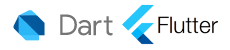

  

 <h2>Angello Villegas</h2> 

Im a Full Stack Software Developer interested in human behavior and how to make developments more attractive to the customers using the behavioral sciences.
 

	
🔧&nbsp;&nbsp;&nbsp;<b>Projects</b>

	 
	<ul style="list-style:none">
		<li>
			📱
			<a href="https://github.com/angellovc/simple_shell">La Haus Brokers</a>
			
La haus app is an application not for customers, but for sellers our app is oriented to improve the service offered by the haus company to people interested in sell a house quickly, smooth and easy, without any burocratic

			<a href="https://angellovc.github.io/lading-haus-brokers/">🌐 Landing Page</a> 
			<a href="https://www.youtube.com/watch?v=x-9OQeZsKtI&feature=youtu.be">▶️ Demo</a>
			<ul>
				<li>
					

					
<b>Https:</b>
					La Haus Brokers app is connected with his own back end which is in charge to do the photo quality assesment

				</li>
				<li>
					

					
<b>Frameworks:</b>Dart and Flutter

				</li>
				<li>
					
<b>Design Pattern:</b> Bloc pattern which is recommended by Google based on the model view controller

				</li>
			</ul>
		</li>
		<li>
			
			<a href="https://github.com/davehh1211/AirBnB_clone_v4">AirBnB-Clone</a>
			<ul>
				<li>
					
<b>Console:</b> Usefull to test features before these have been uploaded using Python

				</li>
				<li>
					
<b>Restfull API:</b> An api was created using flask to get all the properties published

				</li>
				<li>
					
<b>Storage Engine:</b> SQLalchemy which is a python framework is used to store the AirBnB clone information into MySQL data base

				</li>
				<li>
					
<b>Dynamic Content:</b> The content is retreived from MySQL database and is used dynamically in the webside using Jinja and Javascript

				</li>
			</ul>
		</li>
		<li>
			
			<a href="https://github.com/angellovc/simple_shell">Shell</a>
			
Shell Replica, Low Level Project

		</li>
		<li>
			
			<a href="https://github.com/angellovc/printf">Print F</a>
			
_printf() is a project based on the famous printf function that you can find in C lenguaje

		</li>
		<li>
			
			<a href="https://github.com/angellovc/holbertonschool-higher_level_programming">Standart Library</a>
			
This Project series is created to get the first look into the C language by creating the most populars functions found in the standard library

		</li>
	</ul>

	
📕&nbsp;&nbsp;&nbsp;<b>Blogs</b>

	 
	<ul>
		<li>
			<a href="https://www.linkedin.com/pulse/what-happen-when-you-type-web-page-your-browser-angello-villegas/">What happen when you type in a web page on your browser</a>
		</li>
		<li>
			<a href="https://www.linkedin.com/pulse/dynamic-libracy-angello-villegas/">Dynamic library </a>
		</li>
		<li>
			<a href="https://www.linkedin.com/pulse/what-c-static-library-why-you-need-angello-villegas/">What is a C static library and why you need it</a>
		</li>
		<li>
			<a href="https://www.linkedin.com/pulse/linux-hard-symbolic-links-angello-villegas/">Linux Hard & Symbolic links </a>
		</li>
		<li>
			<a href="https://www.linkedin.com/pulse/first-step-linux-angello-villegas/">First Steps on Linux</a>
		</li>
	</ul>

	
🚀&nbsp;&nbsp;&nbsp;<b>Skills</b>

	 
	<ul class="skills" style="list-style:none">
		
Low level:

		<li>
			
		</li>
		
Web Stack Front:

		<li>
			
			
			
			
		</li>
		
Mobile Stack:

		<li>
					
		</li>
		
Back End Stack:

		<li>
			
		</li>
	</ul>

#### Find me on

---

---

