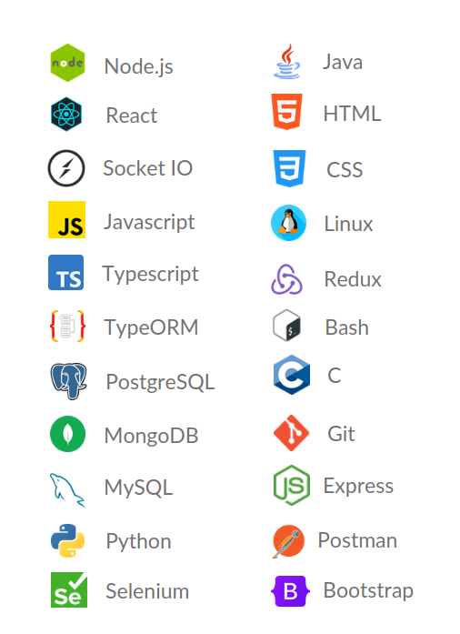

  

<h2 >Angello Villegas</h2>

 

Im a Full Stack Software Developer interested in human behavior and how to make developments more attractive to the customers using the behavioral sciences.
 

	
🔧&nbsp;&nbsp;&nbsp;<b>Projects</b>

	 
	<ul style="list-style:none">
		<li>
			
			<a href="https://angello.ddns.net"> 
				Download WalkieTalkie Client
			</a> 
			

				WalkieTalkie is a console chat that uses web socket connection for real time communication. It runs in every terminal as long as there's node 14 or upper installed in the PC.
				If you have questions about how to run the WalkieTalkie client, please go to the sourceCode Github page in which you'll find instructions.
			

			
			<a href="https://github.com/angellovc/librarian"> 
				WalkieTalkie Source code
			</a> 
			
 - Technologies stack:

			<ul>
				<li>
					
<b>Typescript</b>

				</li>
				<li>
					
<b>Blessed</b>

				</li>
				<li>
					
<b>Inquirer</b>

				</li>
				<li>
					
<b>Socket IO</b>

				</li>
				<li>
					
<b>PM2</b>

				</li>
				<li>
					
<b>Nginx</b>

				</li>
			</ul>
		</li>
		<li>
			
			<a href="https://angello.ddns.net"> 
				Librarian App
			</a> 
			

				This is a full stack app designed to have a record of the books you've read with reviews and comments on it.
			

			
			<a href="https://github.com/angellovc/librarian"> 
				Librarian Source Code
			</a> 
			
 - Technologies stack:

			<ul>
				<li>
					
<b>Typescript</b>

				</li>
				<li>
					
<b>Redux</b>

				</li>
				<li>
					
<b>React</b>

				</li>
				<li>
					
<b>ExpressJs</b>

				</li>
				<li>
					
<b>JWT</b>

				</li>
				<li>
					
<b>Typeorm</b>

				</li>
				<li>
					
<b>Postgresql</b>

				</li>
				<li>
					
<b>Cerbot</b>

				</li>
				<li>
					
<b>Passport JS</b>

				</li>
				<li>
					
<b>PM2</b>

				</li>
				<li>
					
<b>Nginx</b>

				</li>
			</ul>
		</li>
			<li>
				
				<a href="https://reactjournalapp.herokuapp.com"> Journal App</a> 
				This is a Journal App developed in React by using the Redux pattern, you can use it to take notes or as journal
				

				<a href="https://youtu.be/8qym6BoDxgM">▶️ Journal App Demo</a> 
			<ul>
				<li>
					
<b>React</b>

				</li>
				<li>
					
<b>Redux</b>

				</li>
				<li>
					
<b>Google Authentication</b>

				</li>
				<li>
					
<b>User Authentication</b>

				</li>
				<li>
					
<b>Http request</b>

				</li>
				<li>
					
<b>API integrations</b>

				</li>
				<li>
					
<b>Sass</b>

				</li>
				<li>
					
<b>Router and protected Routes</b>

				</li>
			</ul>
		</li>
		<li>
		
		<a href="http://jobgeolocapp.herokuapp.com/home"> JobGeoloc App</a> 
				This is 24h challenge which leave as a result an application which geolocalization that show a list of Jobs retreiving by an API and show his locations into a Map window.
				It is simple and very easy to use. 
			

			

				Credentials:
			

			

					user: tvandervort@example.net
			

			

					password: password
			

			<a href="https://youtu.be/Uajb6dk4Oqw">▶️ JobGeoloc Demo</a> 
						<ul>
				<li>
					
<b>User Authentication</b>

				</li>
				<li>
					
<b>Http request</b>

				</li>
				<li>
					
<b>API integrations</b>

				</li>
				<li>
					
<b>React</b>

				</li>
				<li>
					
<b>Bootstrap</b>

				</li>
				<li>
					
<b>Ajax</b>

				</li>
				<li>
					
<b>Router and protected Routes</b>

				</li>
			</ul>
		</li>
		<li>
			
			<a href="https://angellovc.github.io/React-Giphy-App/">React Giphy App</a>
			
React web application connected to giphy Api to fetch gif the user are loocking for. Type in the search bar the kind of gif you want to retreive and press enter to display the giphi gif you want

		</li>
		<li>
			
📱La Haus Brokers

			
Project developed at Holberton School Colombia with the mentoring and supervision of La Haus

			
La haus app is an application not for customers, but for sellers our app is oriented to improve the service offered by the haus company to people interested in sell a house quickly, smooth and easy, without any burocratic

			<a href="https://angellovc.github.io/lading-haus-brokers/">🌐 Landing Page</a> 
			<a href="https://www.youtube.com/watch?v=x-9OQeZsKtI&feature=youtu.be">▶️ Demo</a> 
			<a href="https://github.com/MiguelP4lacios/La_Haus_broker">🌐 Repository</a>
			<ul>
				<li>
					

					
<b>Https:</b>
					La Haus Brokers app is connected with his own back end which is in charge to do the photo quality assesment

				</li>
				<li>
					

					
<b>Frameworks:</b>Dart and Flutter

				</li>
				<li>
					
<b>Design Pattern:</b> based on the model view controller, Bloc is the pattern recommended by Google

				</li>
			</ul>
		</li>
		<li>
			
			<a href="https://github.com/davehh1211/AirBnB_clone_v4">AirBnB-Clone</a>
			<ul>
				<li>
					
<b>Console:</b> Usefull to test features before these have been uploaded using Python

				</li>
				<li>
					
<b>Restfull API:</b> An api was created using flask to get all the properties published

				</li>
				<li>
					
<b>Storage Engine:</b> SQLalchemy which is a python framework is used to store the AirBnB clone information into MySQL data base

				</li>
				<li>
					
<b>Dynamic Content:</b> The content is retreived from MySQL database and is used dynamically in the webside using Jinja and Javascript

				</li>
			</ul>
		</li>
		<li>
			
			<a href="https://github.com/angellovc/simple_shell">Shell</a>
			
Shell Replica, Low Level Project

		</li>
		<li>
			
			<a href="https://github.com/angellovc/printf">Print F</a>
			
_printf() is a project based on the famous printf function that you can find in C lenguaje

		</li>
		<li>
			
			<a href="https://github.com/angellovc/holbertonschool-higher_level_programming">Standart Library</a>
			
This Project series is created to get the first look into the C language by creating the most populars functions found in the standard library

		</li>
	</ul>

	
📕&nbsp;&nbsp;&nbsp;<b>Blogs</b>

	 
	<ul>
		<li>
			<a href="https://www.linkedin.com/pulse/what-happen-when-you-type-web-page-your-browser-angello-villegas/">What happen when you type in a web page on your browser</a>
		</li>
		<li>
			<a href="https://www.linkedin.com/pulse/dynamic-libracy-angello-villegas/">Dynamic library </a>
		</li>
		<li>
			<a href="https://www.linkedin.com/pulse/what-c-static-library-why-you-need-angello-villegas/">What is a C static library and why you need it</a>
		</li>
		<li>
			<a href="https://www.linkedin.com/pulse/linux-hard-symbolic-links-angello-villegas/">Linux Hard & Symbolic links </a>
		</li>
		<li>
			<a href="https://www.linkedin.com/pulse/first-step-linux-angello-villegas/">First Steps on Linux</a>
		</li>
	</ul>

	
🚀&nbsp;&nbsp;&nbsp;<b>Skills</b>

	 
	<ul style="list-style:none">
		<li>
			
		</li>
	</ul>

---

---

